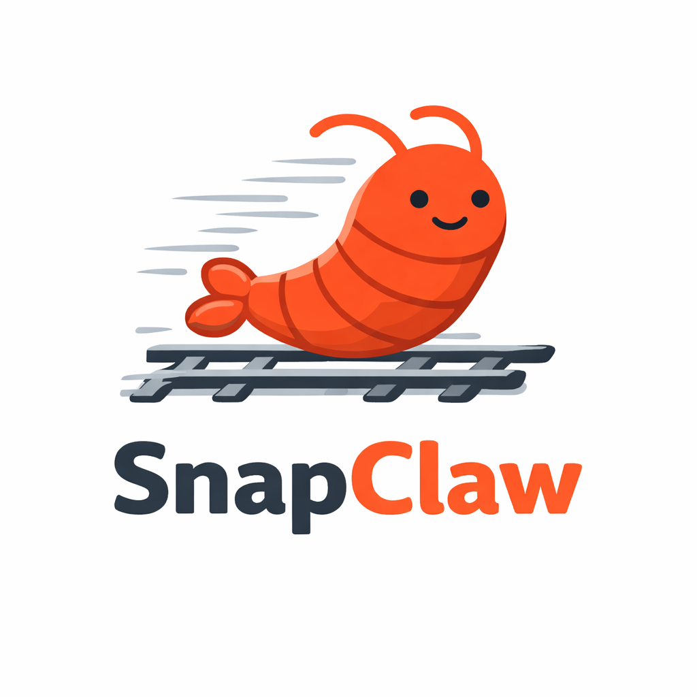

  

<em>Production-ready OpenClaw on Railway</em>

  

Deploy your own AI agent in minutes. Click the button, follow the steps, talk to your bot.

## Step 1 — Deploy 
1. Click **Deploy on Railway** button above
2. Click **Deploy Now** in Railway
3. Click **Configure** → set environment variables:
   - `SETUP_PASSWORD` — create a password for the admin panel
   - `OPENCLAW_GATEWAY_TOKEN` — any random token ([generate one here](https://www.uuidgenerator.net/))
4. Click **Deploy**
5. Wait for the build to finish

## Step 2 — Setup 
1. Go to Railway dashboard → your service → **Settings → Networking** → click your domain link
2. Log in with any username and your `SETUP_PASSWORD`
3. Click **"Start setup"** — this opens an interactive terminal in your browser
4. Follow the prompts to choose an AI provider, add channels, and configure your bot

<strong>Answers for quick setup</strong>

1. **"I understand this is personal-by-default..."** → Yes
2. **Setup mode** → QuickStart
3. **OpenAI Codex OAuth** — copy the URL, paste in your browser
   - Log into ChatGPT
   - Click **"Sign in to Codex with ChatGPT"** (don't worry about the empty screen after sign-in)
   - Copy the redirect URL from your browser
   - Paste it back in the terminal
4. **Select channel** → Telegram
5. **"How do you want to provide this Telegram bot token?"** → select **"Enter Telegram bot token"**
6. Create your bot:
   - Open Telegram, search for **@BotFather** (official bot with blue checkmark)
   - Start chat → send `/newbot`
   - Enter a bot name (doesn't need to be unique)
   - Enter a bot username (must be unique, must end with `_bot`)
   - Click on the token to copy it (looks like `123456:ABC...`)
7. Paste the token in the terminal
8. **Search provider** → DuckDuckGo Search (free, no API key needed)
9. **Configure skills** → No (defaults are enough, add more later)
10. **Enable hooks** → select **session-memory** (helps the bot remember you), skip the rest
11. **Hatch your bot** → Do this later

5. After setup completes, click **"Onboarding complete"** to start the gateway

## Step 3 — Approve devices

1. Click **"Open Web UI"** link on the setup page (creates a pairing request), then come back
2. **Telegram:** Open your bot in Telegram → click **Start** → it shows a pairing code. Enter the code on the setup page → click **Approve**
3. Click **"Refresh pending devices"** → click **Approve**

## Step 4 — Talk to your bot (you're done!)

- **Telegram** — message your bot
- **Web UI** — open your Railway domain link

---

## Your data is safe

All your data lives on a Railway Volume at `/data` and survives redeploys and OpenClaw updates:

- **Conversations** — full chat history with your bot
- **Memory** — what your bot learned about you
- **Config** — AI provider, channels, settings
- **Credentials** — API keys, OAuth tokens
- **Skills** — installed plugins and custom skills
- **Workspace** — bot personality files, scripts

To update OpenClaw, just redeploy — your data stays.

## Batteries included

SnapClaw ships with a curated pack of lightweight skills that don't break the default OpenClaw workflow — they just make it work better. No frameworks, no opinions, no bloat. I use all of these daily.

| Skill | What it does | Trigger |
|---|---|---|
| **Memory Sleep** | Scans daily logs, merges into `MEMORY.md` — like REM sleep for your AI | Nightly cron (3 AM) or say "dream" |

## AI providers

| Provider | Cost | Notes |
|---|---|---|
| **OpenAI Codex OAuth** | Free (ChatGPT sub) | Recommended — auto-refreshes tokens |
| **Anthropic API key** | Pay per token | Simple, reliable, no expiry |
| **OpenAI API key** | Pay per token | Simple, reliable, no expiry |

## Credits

- **OpenClaw**: [openclaw.ai](https://openclaw.ai) | [GitHub](https://github.com/openclaw/openclaw)
- **SnapClaw**: maintained by [@balukov](https://github.com/balukov)
